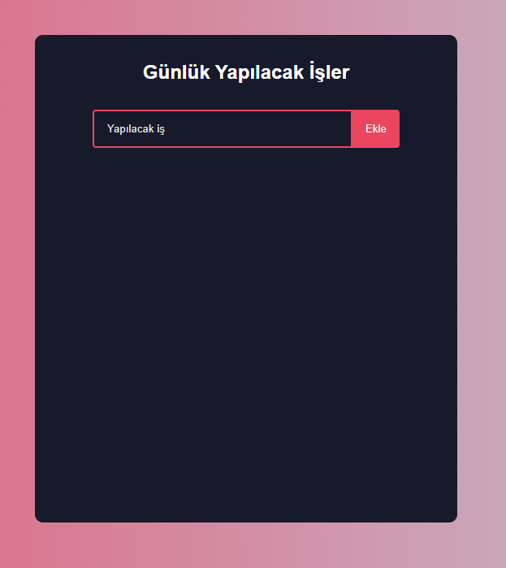
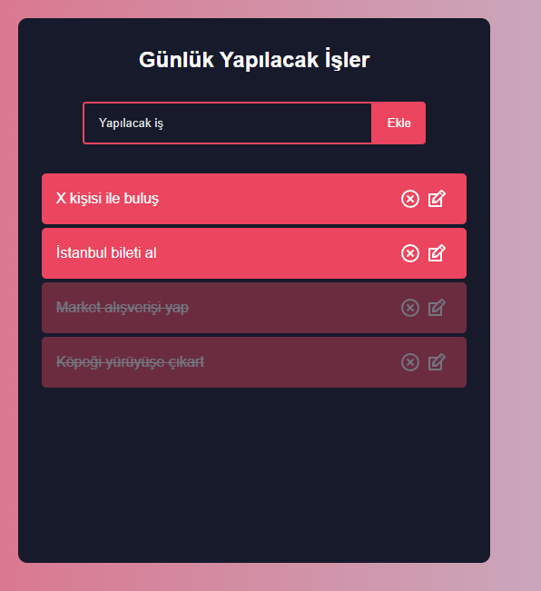
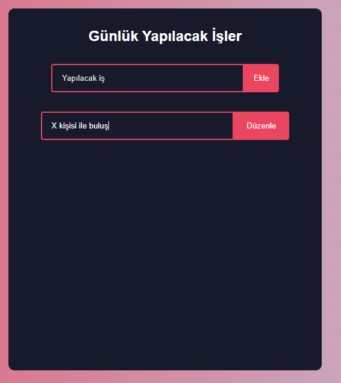

## Todo List With React
This is a todo list reactjs project i made while my learning process


## install
``` bash
# gerekli kurulumların yapılması
npm install

# start
npm start
```
## some screenshots
<br>
app main page


<br>
added some subjects and selected as done

<br>
editing subjects
